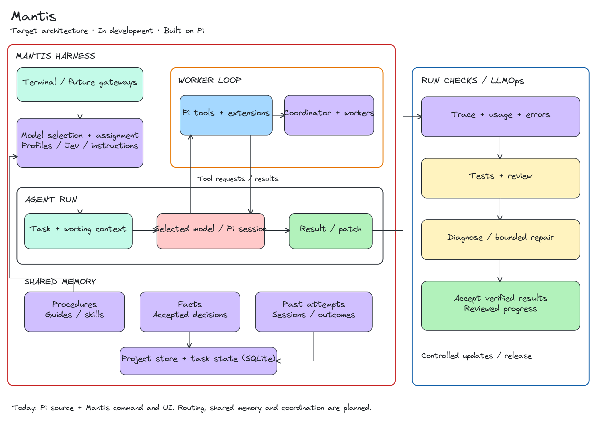

# Mantis

A coding-agent harness built on [Pi](https://github.com/earendil-works/pi), focused on efficient work with free hosted and self-hosted models.

**In development.** The current foundation is Pi v1.0.2 with a Mantis command and terminal identity. Model routing, task coordination, shared memory, and run checks are planned additions.



## Run from source

Requires Node.js 22.19 or newer.

```bash
cd pi
npm ci --ignore-scripts
npm run hydrate:model-data
cd ..
./mantis
```

Configure a model before submitting a task. Mantis currently inherits Pi's process permissions; the free-model policy and execution boundaries are not yet enforced.

## Development

We build in small steps: understand the change, review it, check it, then commit with explicit approval.

Built on [Pi](https://github.com/earendil-works/pi). See its [MIT license](pi/LICENSE).
